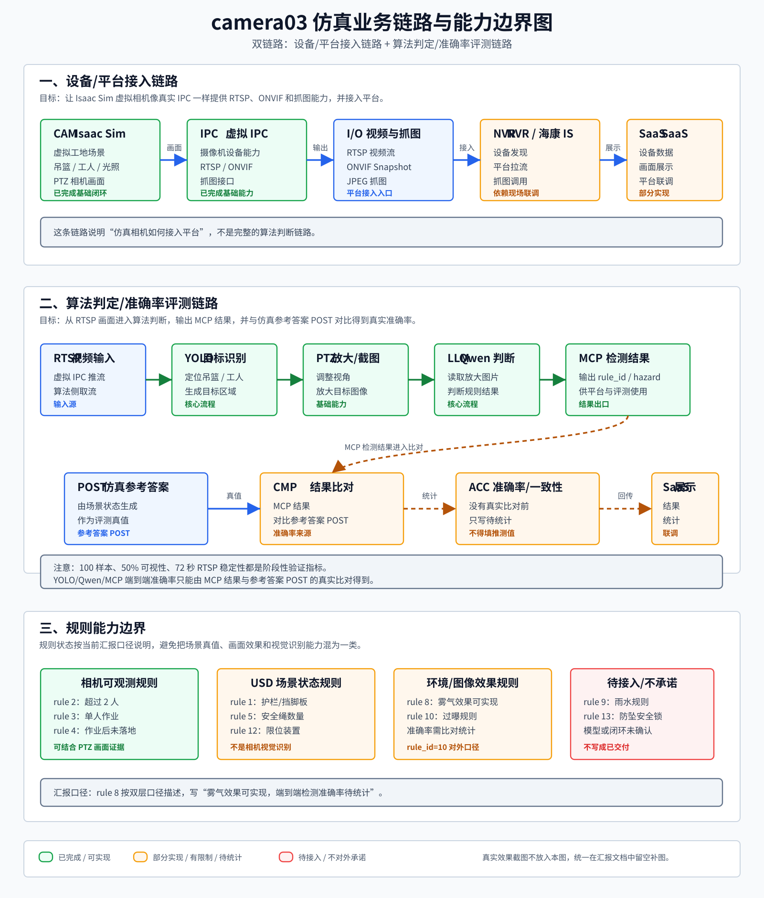

# camera03 仿真成果汇报

本文档用于说明 `camera03` 仿真项目目前做到什么程度、可以实现哪些功能、效果如何、哪些能力暂时不承诺。文档面向项目汇报和交接阅读，不作为代码审计材料。



## 1. 项目概述

`camera03` 是一套基于 NVIDIA Isaac Sim 的虚拟 PTZ 安防相机仿真项目。项目目标不是单纯渲染一段画面，而是把工地吊篮场景模拟成一台可接入平台的虚拟 IPC，并支持算法侧基于 RTSP 画面进行规则判断，再与仿真参考答案进行比对。

当前项目应按两条并存链路理解：

- 设备/平台接入链路：证明虚拟 IPC 可以像真实摄像机一样提供 RTSP、ONVIF、抓图能力，并接入 NVR、海康 IS 或 SaaS。
- 算法判定/评测链路：证明算法可以从 RTSP 取流，经 YOLO、PTZ 放大/截图、Qwen 判断和 MCP 输出结果，再与仿真参考答案 POST 对比，形成准确率或一致性统计。

一句话概括：这个项目既模拟一台可接入平台的“虚拟工地摄像机”，也为算法规则判定提供可验证的仿真闭环。

## 2. 业务链路

### 2.1 设备/平台接入链路

```text
Isaac Sim 虚拟 IPC
  -> RTSP / ONVIF
  -> NVR / 海康 IS
  -> SaaS 平台
```

这条链路解决“仿真相机如何接入平台”的问题。SaaS、NVR 或海康 IS 不需要理解 Isaac Sim 内部实现，只需要按真实 IPC 的方式拉流、抓图和管理设备。

当前可汇报的接入能力：

- 虚拟 IPC 可以提供 ONVIF 设备能力。
- 可以通过 ONVIF 获取抓图地址并抓取图片。
- 可以通过 RTSP 拉取视频流。
- NVR、海康 IS、SaaS 可作为外部平台接入链路的一部分，最终效果依赖现场配置和联调环境。

### 2.2 算法判定/评测链路

```text
RTSP
  -> YOLO 目标识别
  -> PTZ 放大/截图
  -> Qwen 大模型规则判断
  -> MCP 输出检测结果
  -> 与仿真参考答案 POST 比对
  -> 统计准确率 / 一致性
  -> SaaS 展示
```

这条链路解决“拿到画面之后如何判断规则，以及如何证明判断是否正确”的问题。准确率不能直接来自仿真生成数量或相机可视性比例，必须来自 MCP 检测结果与仿真参考答案 POST 的对比。

当前文档中涉及准确率的口径统一为：

- 已有样本生成、相机可视性、RTSP 和 ONVIF 链路验证结果，可以作为阶段性验证指标。
- YOLO/Qwen/MCP 端到端检测准确率，没有真实比对统计前只写“待统计”，不填推测值。

### 2.3 两条链路的关系

两条链路可以同时存在，且职责不同：

- 接入链路是前置基础设施，证明虚拟 IPC 能被平台按真实摄像机使用。
- 判定/评测链路是核心业务闭环，证明算法判断结果可以被参考答案校验。
- SaaS 既可以作为设备接入和抓图展示入口，也可以展示 MCP 结果、参考答案比对结果和准确率统计。

> [待补图：NVR 或海康 IS 接入虚拟 IPC 的设备页面截图]
>
> [待补图：SaaS 平台展示 RTSP 或 ONVIF 抓图结果的页面截图]
>
> [待补图：MCP 检测结果与参考答案 POST 比对后的准确率统计页面或表格]

## 3. 功能进度

| 功能 | 当前状态 | 汇报说明 |
|---|---|---|
| Isaac Sim 工地场景 | 已完成基础闭环 | 可以加载工地、吊篮、工人、光照和相机画面 |
| PTZ 虚拟相机 | 已完成基础能力 | 支持水平、俯仰、变焦控制，可服务于放大/截图链路 |
| Web 控制台 | 已完成基础能力 | 支持启动、停止、画面查看、PTZ 控制和场景控制 |
| 虚拟 IPC | 已完成基础能力 | 对外提供 RTSP、ONVIF 和抓图能力 |
| ONVIF 抓图 | 已完成 | 可获取当前画面 JPEG |
| RTSP 推流 | 已完成基础能力 | 可供 VLC、NVR、平台或算法侧拉流 |
| NVR / 海康 IS / SaaS 接入 | 部分完成 / 需联调 | 接入能力已具备，最终效果依赖现场平台配置 |
| 场景随机化 | 已完成基础能力 | 可随机吊篮、工人、相机视角和环境光等状态 |
| 参考答案 POST | 已完成基础口径 | 可输出当前场景对应的规则编号、隐患状态和判断依据 |
| YOLO 目标识别链路 | 已纳入核心流程 | 以 RTSP 视频作为输入，准确率需以后续比对统计为准 |
| PTZ 放大/截图 | 已完成基础能力 | 用于把检测目标放大后交给大模型判断 |
| Qwen 规则判断 | 已纳入核心流程 | 作为规则判断环节，结果需与参考答案 POST 对比 |
| MCP 检测结果输出 | 已纳入核心流程 | 用于输出算法侧判断结果，供平台展示和比对 |
| 准确率/一致性统计 | 待统计 | 必须基于 MCP 结果与参考答案 POST 的真实比对结果 |

> [待补图：Web 控制台启动 Isaac Sim 后的实时画面截图]
>
> [待补图：ONVIF 抓图效果截图]
>
> [待补图：RTSP 拉流效果截图]
>
> [待补图：YOLO 检测、PTZ 放大、Qwen 判断或 MCP 结果展示截图]

## 4. 规则支持情况

当前规则能力分为四类：相机画面可观测规则、USD 场景状态规则、环境/图像效果规则、暂不承诺规则。

| rule_id | 规则 | 当前状态 | 说明 |
|---:|---|---|---|
| 1 | 防护栏/挡脚板缺失或不可用 | 可实现 | 基于 USD 场景状态判断，不写成相机视觉识别能力 |
| 2 | 吊篮内作业人员超过 2 人 | 可实现 | 可结合场景人数和相机可观测性判断 |
| 3 | 吊篮单人作业 | 可实现 | 可结合场景人数和相机可观测性判断 |
| 4 | 作业结束后吊篮未降至地面 | 可实现 | 可结合吊篮高度、人数和相机可观测性判断 |
| 5 | 安全绳未单人使用 | 可实现但有限制 | 按安全绳数量口径判断，不做人和绳一一绑定 |
| 8 | 雾气过大导致画面模糊 | 雾气效果可实现，准确率待统计 | Web 体积雾效果可演示；作为检测规则时需通过 YOLO/Qwen/MCP 与参考答案 POST 比对后统计 |
| 9 | 雨水过大导致画面模糊 | 待接入 | 当前不写成完整判定闭环 |
| 10 | 光照过大导致过曝 | 可实现 | 对外和 SaaS 口径使用 `rule_id=10` |
| 12 | 限位装置不符 | 可实现 | 基于 USD 场景状态判断，不写成相机视觉识别能力 |
| 13 | 防坠安全锁不符 | 不对外承诺 | 因模型资产或部件口径未确认，当前不作为已实现能力 |

重点说明：

- `2/3/4` 是当前与相机画面关系最强的规则，可以说明 PTZ 后是否能拍到吊篮或工人相关证据。
- `1/5/12` 可以实现标准答案，但依赖场景模型状态，不等同于视觉算法已经识别出对应物体。
- `rule_id=8` 按双层口径描述：雾气效果可实现，但端到端检测准确率需要真实比对后补充。
- `10` 是对外汇报和 SaaS 使用的过曝规则编号。
- `13` 即使代码中有历史预留，也不写成已完成能力，避免对外承诺过度。

## 5. 阶段性验证结果

当前可以汇报的量化结果如下。它们是仿真链路和数据质量验证指标，不是 YOLO/Qwen/MCP 端到端检测准确率。

| 指标 | 当前结果 | 说明 |
|---|---|---|
| 数据结构生成 | 100 样本，0 失败 | 表示批量场景数据生成未出现结构异常 |
| 场景类型分布 | 单吊篮高空 34、双吊篮高空 33、全部落地 33 | 样本分布基本均衡 |
| 相机可视性检查 | 100 样本中 50 个通过，50 个失败 | 50% 只表示当前采样策略下的可视性通过比例 |
| RTSP 稳定性 | 5 次随机化期间连续拉流 72 秒正常 | 表示随机化过程中视频流保持稳定 |
| ONVIF 抓图 | 可返回 JPEG 图片 | 可作为平台抓图入口 |
| YOLO/Qwen/MCP 端到端检测准确率 | 待统计 | 需基于 MCP 结果与参考答案 POST 的真实比对结果填写 |

这些数据的含义需要区分：

- 结构生成结果说明仿真数据生成流程可用。
- 相机可视性 50% 说明当前相机采样策略仍需优化，不能作为 AI 模型指标。
- RTSP 和 ONVIF 结果说明摄像机接入链路可用。
- 端到端检测准确率必须由算法侧输出结果与参考答案 POST 比对得到，不能用其他指标替代。

> [待补图：结构生成样本展示，建议放 2-3 张不同场景截图]
>
> [待补图：相机可视性通过样本与失败样本对比图]
>
> [待补图：MCP 结果与参考答案 POST 的比对表或准确率统计截图]

## 6. 当前限制

当前项目已经完成主要仿真和接入基础，但仍有一些边界需要在汇报中说明清楚：

1. YOLO/Qwen/MCP 端到端检测准确率目前不填具体数值，必须等待真实比对结果。
2. 相机可视性还需要继续优化。当前 100 个样本中 50 个通过，可视性问题主要来自相机视角、目标偏离、距离和离轴角度。
3. `1/5/12` 不是图像识别规则，而是场景模型状态规则。它们可以生成参考答案，但不能等同于视觉算法已经识别出对应物体。
4. `5` 当前只按安全绳数量判断，不做人和安全绳绑定关系判断。
5. `8` 雾气效果可演示，但完整检测准确率仍需通过算法输出与参考答案 POST 比对。
6. `9` 雨水规则暂未写成完整判定闭环。
7. `13` 防坠安全锁当前不对外承诺，原因是模型资产或部件口径未确认。
8. 平台侧最终效果依赖 NVR、海康 IS、SaaS 的现场配置和联调环境。
9. 历史上出现过过曝残留导致白屏的问题，后续需要做照明恢复机制。

## 7. 后续计划

后续建议按以下优先级推进：

1. 补齐 MCP 检测结果与参考答案 POST 的比对表，形成真实端到端准确率。
2. 优化相机采样和目标约束，提高可视性通过率。
3. 完善 YOLO、PTZ、Qwen、MCP 的截图和联调证据，形成可汇报闭环。
4. 完善过曝关闭后的照明恢复，减少白屏残留。
5. 继续做海康 IS、NVR、SaaS 的端到端联调。
6. 如果业务需要，再补充雾、雨对应的完整隐患判定和准确率统计。
7. 如果后续补齐防坠安全锁模型，再重新评估 `rule_id=13` 是否纳入实现范围。
8. 汇报材料中补充 Web 控制台、ONVIF 抓图、平台接入、典型样本效果截图。

## 8. 待补图片位置

后续可以按以下位置补图：

1. 项目总体业务链路图：已放入当前文档。
2. Web 控制台画面：展示 Isaac Sim 启动后的实时画面。
3. ONVIF 抓图效果：展示虚拟 IPC 抓图结果。
4. RTSP 拉流效果：展示虚拟 IPC 视频流被算法侧或平台侧读取。
5. SaaS 或海康 IS 接入效果：展示平台侧接入后的画面。
6. YOLO 检测结果：展示 RTSP 画面中的目标框。
7. PTZ 放大/截图效果：展示放大后的判断输入图。
8. Qwen 判断和 MCP 输出结果：展示算法侧判定结果。
9. 参考答案 POST 比对表：展示 MCP 结果与仿真参考答案的一致性和准确率。
10. 可视性对比图：展示可观测样本和不可观测样本差异。
